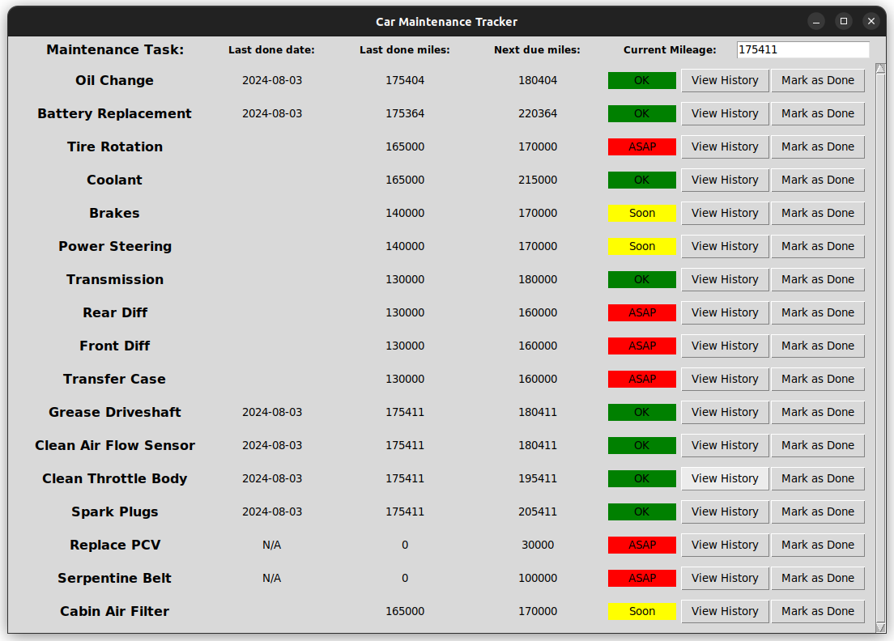

# Car Maintenance Tracking Application

This python application can be used to keep track of your regular car maintenance items. The application manages a data base which will keep track of the milage and date of when you last performed the required maintenance and then indicate if this action needs to be taken again soon or not. Simply type in your current milage into the upper left corner and then hit enter and it will indicate what actions need to be taken.

## Setup
First run the dbSetup.py script to initialize your database file. Then modify the config.json file to contain a list of regular maintenance tasks along with their service intervals. ``{"task": "Oil Change", "frequency_miles": 5000, "frequency_max_miles": 7500},`` The ``frequency_miles`` indicates idealy how often you should be doing this task, if the mileage since this task was last preformed is over this number the status box will turn yellow and indicate "Soon". The ``frequency_max_miles`` indicates the max amount of miles that should be allowed to elapse before doing this task, if the mileage since this task was last preformed is over this number the status box will turn red and indicate "ASAP".

The current configuration of this application is set to mirror the recommended maintenance for a 2009 Toyota Tacoma.

This table was taken from this forum post https://www.tacomaworld.com/threads/2nd-gen-diy-maintenance-quick-reference-guide.438945/

## Edit Maintenance Record
For now the easiest way to edit your maintenance record is to use sqlitebrowser to open and edit your car_maintenance.db file. https://sqlitebrowser.org/